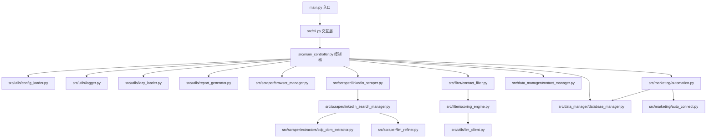
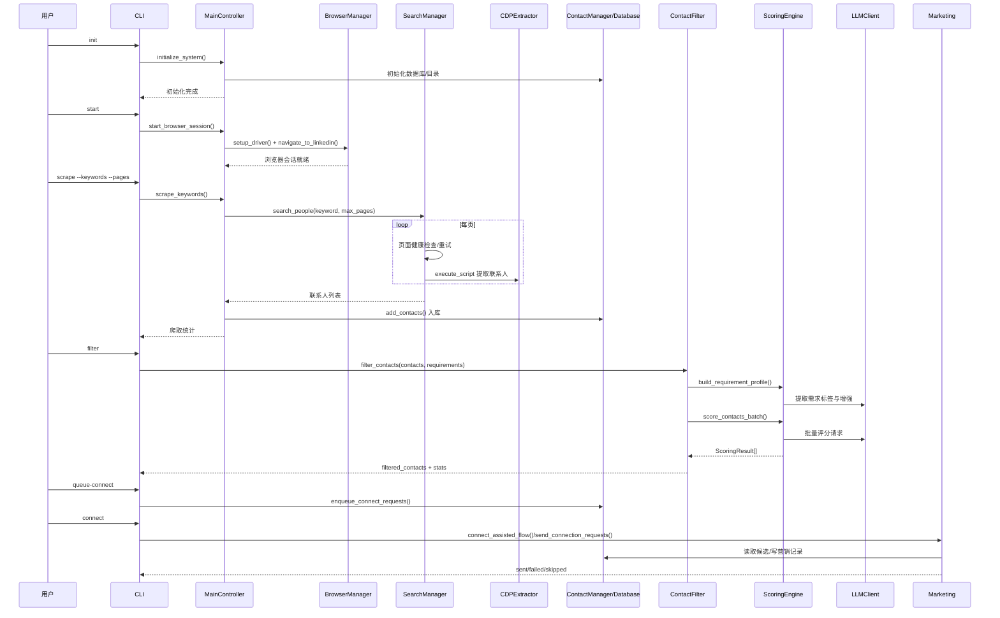
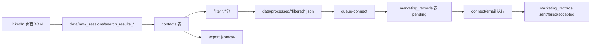

# LinkedIn 爬虫项目架构与数据流图

## 1) 模块依赖图

## 2) 核心时序图（init/start/scrape/filter/connect）

## 3) 数据流图（raw → DB → processed → outreach）

## 4) 批量打分关键配置

- `filtering.llm_batch_size`: 唯一批量人数配置（每次发送人数）
- `filtering.llm_score_bulk_max_tokens`: 批量评分请求 token 上限
