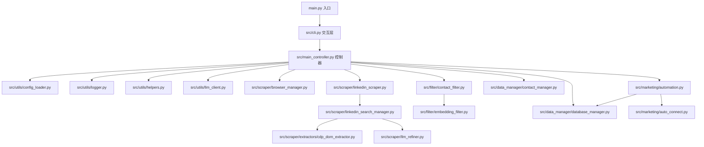
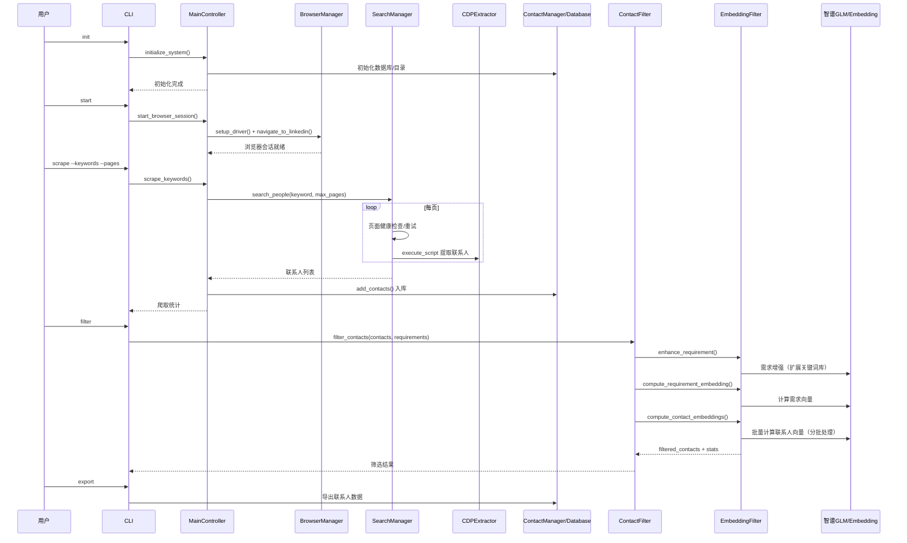
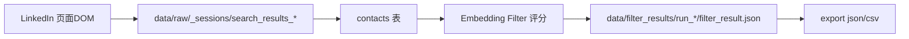
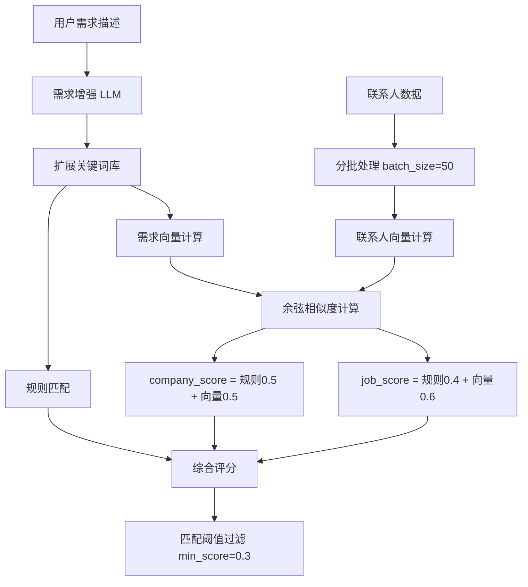

# LinkedIn 爬虫项目架构与数据流图

## 1) 模块依赖图



## 2) 核心时序图（init/start/scrape/filter/connect）



## 3) 数据流图（raw → DB → filter → processed）



## 4) Embedding 筛选引擎架构



## 5) 批量处理关键配置

- `embedding_model.batch_size`: 50（智谱API限制单次≤64条）
- `embedding_model.timeout`: 60秒
- `embedding_model.dimensions`: 512（向量维度）
- `llm_enhancement.enabled`: true（需求增强开关）
- `llm_enhancement.timeout`: 60秒

## 6) 评分权重配置

| 分数项 | 权重 | 说明 |
|--------|------|------|
| embedding_similarity | 0.3 | 向量相似度 |
| company_match | 0.4 | 公司匹配（规则+向量） |
| job_keywords | 0.3 | 职位匹配（规则+向量） |

最终评分公式：
```
job_score = job_rule * 0.4 + similarity * 0.6
company_score = company_rule * 0.5 + similarity * 0.5
match_score = similarity * 0.3 + company_score * 0.4 + job_score * 0.3
```